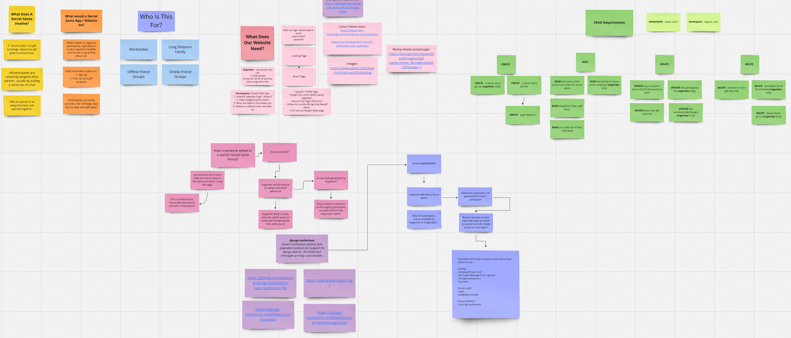

# 

# Welcome to Home Not Alone!

## The Secret Santa Planning App
### Home Not Alone is dedicated to making planning your next Secret Santa super simple, while keeping everyone's secret gifts a Santa-sized surprise!

The responsive website allows registered users to create participant lists for gift giving activities, allowing easy inviting and assignment distribution, along with setting a recommended budget for all gifts involved. Users who are not registered are recommended to check out the website's About page, and are free to sign up for their own account. 

# [Link to Live Site](#)  

This project is created as a final hackathon project for Code Institute's 16 week fullstack developer bootcamp.  

Built by Team "Santa's Little Nerds": Jack, Bryan, Oleksii and Emma.

---

# Table of Contents  

 1. [UX](#ux)
 2. [Agile Development](#agile-development)
 3. [Features Implemented](#features-implemented)  
 4. [Features Left to Implement](#features-left-to-implement)  
 5. [Technology Used](#technology-used) 
 6. [Testing](#testing-and-validation)  
 7. [Bugs](#known-bugs)  
 8. [Deployment](#deployment)
 9. [Resources](#resources)  
 10. [Credits and Acknowledgements](#credits-and-acknowledgements)

---

# UX

## Database Planning

Going into the planning stages, we knew that we would need three main models to plan out:
   - The User
   - The Event
   - The Participant 

- **Relationships:**
  - **Many-to-One with Event:**  
    Each `Participant` is linked to one `Event`, but an `Event` can have multiple `Participants`.
  
  - **One-to-One with User:**  
    Each `Participant` can be associated with one `User` account, allowing for personalized interactions and access.
  
  - **Self-Referential Many-to-One with Participant:**  
    Establishes the Secret Santa pairing by linking each `Participant` to another `Participant` as their recipient.

### **Key Points**

- **Role Management:**
  - Users are assigned to groups (`Organiser` or `Participant`) which determine their permissions and accessible features within the application.
  
- **Invitation Flow:**
  - **Organisers** can invite participants via email. Invited participants receive an invitation link to register and join the event.
  - Upon accepting an invitation, a participant's `user` field is populated, and they are assigned to the `Participant` group.
  
- **Secret Santa Assignments:**
  - Organisers can trigger the `random_santa` function, which shuffles participants and assigns each one a unique recipient.
  - The `assigned_recipient` field ensures that each participant knows who they are gifting to, maintaining the secrecy of the process.
  
- **Data Integrity:**
  - The use of foreign keys and one-to-one relationships ensures referential integrity within the database.
  - Deleting an `Event` cascades to remove all associated `Participants`, maintaining a clean database state.

## UX Design

### Overview

### Site User
Inspired by a classic Christmas movie from our childhoods, Home Not Alone is aimed at long distance friends and family groups, large parties, and work groups. While themed for Christmas, it is possible to reskin the project to fit other holidays in future.

There are two primary views on the site: 
1. **The Organiser**, who sets up the groups and issues invites to participants, and 
2. **The Participant**, who can see the name of their assigned gift recipient, the recipient's wish list, and the option to set up a wishlist of their own.

### Goal
This site's goal is to enable people to organise gift giving activities easily between large groups of people, particularly those who may be long distances away. 

## Wireframes

We made four wireframes to cover the layouts for 4 main pages: the front page, the sign in page, the sign up page, and the landing page when logged in.

##### [ Back to Top ](#table-of-contents)

# Agile Development

When collaborating on ideas for our group project, we created a dedicated Miro board. We ideated on our plans, broke it down into pieces to examine the purpose and target audience, and determined what key elements were needed for both the UX design and the Entity Relationship Diagram for Django.   
- [Home-not-Alone Miro Board](https://miro.com/app/board/uXjVL2ywJpk=/?share_link_id=472010981286)

We also set up a kanban board for tracking our project's user stories on GitHub's Projects site. Our project board can be found here: 
- [Home-not-Alone Project Board](https://github.com/users/jack-brosnan/projects/9)

### User Stories Overview

1. _User Story 1: Create and Manage Events_
   - As a organiser I can create a new Secret Santa event so that I can easily host a gifting exchange for my group.

2. _User Story 2: Account Registration_
   - As an organiser, I can easily find the sign up page and create an account on the website that will let me host a gifting exchange for my group.
   - As a participant, I can easily accept the invite link and create an account to join my secret santa's group.

3. _User Story 3: Event Details_
   - As an organiser, I can create a new group with appropriate settings that will allow me to invite the correct participants.
   - As a participant, I can see what gift giving group I am a member of and the relevant requirements for the group.

4. _User Story 4: Participant Profile_
   - As an organiser, I can clearly see the names of all participants and who they have been assigned as their gift recipient.
   - As a participant, I can clearly see the name of my drawn gift recipient.
   - As a participant, I can add, modify and delete a wish list that will be shown to my gift giver.

5. _User Story 5: Secret Santa site theming_
   - As a site administrator, I want to have strong colour palette and appearance choices for my website's appearance - so that it fits both the holiday season and the site's theme.

6. _User Story 6: Landing Page_
   - As a site user, I want a landing page that introduces me to the secret santa website.

7. _User Story 7: About Page_
   - As a site user, I want a landing page that introduces me to the secret santa website.

##### [ Back to Top ](#table-of-contents)

# Features Implemented

## 📄 Pages and Features

### **Home Page**
The central hub of the application dynamically displays content based on the user's role. Organisers can view and manage their events, while Participants access their portal to see event details, assigned recipients, and update their wishlists. Unauthenticated users are prompted to log in or register to gain access.

### **Add Event Page**
Allows Organisers to create new Secret Santa events by providing essential details such as title, description, budget, date, and an optional image. The form includes validation to ensure all required fields are correctly filled, and upon successful creation, Organisers receive a confirmation message.

### **Edit Event Page**
Enables Organisers to modify existing event details. Organisers can update information like the event's title, description, budget, date, and image. The page provides feedback on successful updates or errors if any issues arise during the editing process.

### **Delete Event**
Provides Organisers with the ability to remove events they have created. Upon confirmation, the event and all associated participants are permanently deleted from the database, and Organisers receive a success notification.

### **View Event Page**
Offers Organisers a detailed view of a specific event, including all participants involved. From this page, Organisers can manage participants, send invitations, and initiate the random assignment of Secret Santas. It serves as a comprehensive overview of the event's current state.

### **Edit Participant Page**
Allows Organisers to manage participants within an event. They can add new participants by entering their name and email, edit existing participant details, or remove participants as needed. The page ensures that all participant information is accurately maintained.

### **Random Santa Assignment**
Enables Organisers to randomly assign each participant a recipient for Secret Santa gifting. The feature ensures that each participant is paired with a unique recipient, preventing self-assignment. Once assignments are made, Organisers receive a confirmation message.

### **Invite Participant**
Facilitates Organisers in sending invitation emails to participants who have not yet registered. By entering a participant's email, Organisers can send a personalized invitation link, enabling them to join the event and participate in the Secret Santa exchange.

### **Participant Portal (Integrated into Home Page)**
Serves as the dedicated space for Participants to interact with their Secret Santa event. Participants can view event details, see their assigned recipient and the recipient's wishlist, and update their own wishlist items. The portal provides real-time feedback upon successfully updating the wishlist.

### **User Authentication Pages**
Handled by `django-allauth`, these pages manage user registration, login, logout, and password management. New users can register or accept invitations, existing users can securely log in, and all users can reset their passwords via email if needed.

### **Admin Dashboard**
Utilizes Django's built-in admin interface to provide superusers and staff members with comprehensive management capabilities. Administrators can manage users, events, and participants, ensuring full oversight and control over the application's data and functionalities.

---

## 🛠️ Additional Features

### **Role-Based Access Control**
Implements distinct permissions for Organisers and Participants. Organisers have the authority to create and manage events and participants, while Participants can view event details, their assigned recipients, and manage their own wishlists.

### **Email Integration**
Configured to send emails using Gmail's SMTP server, allowing Organisers to send invitations and Participants to receive notifications. Email credentials are securely managed through environment variables, ensuring sensitive information remains protected.

### **Frontend Enhancements**
Incorporates responsive design principles to ensure usability across various devices. Utilizes Crispy Forms with Bootstrap 5 for enhanced form rendering and Cloudinary for efficient image storage and delivery.

### **Security Measures**
Ensures the application follows best security practices by storing sensitive information in environment variables, enforcing strong password policies, and implementing access controls through middleware and decorators.

---

##### [ Back to Top ](#table-of-contents)

# Future Features

### **1. Switch to SendGrid for Email Sending**

**Current Implementation:**

Currently, the application utilizes Gmail's SMTP server to send essential emails such as invitations and notifications. While Gmail SMTP is effective for development and small-scale deployments, it presents limitations in scalability, deliverability, and advanced email management features.

**Planned Enhancement:**

Transitioning to **SendGrid**, a dedicated email service provider, will offer numerous advantages that enhance the application's email capabilities and overall user experience.

##### [ Back to Top ](#table-of-contents)

# Technology Stack

- Frontend Languages: HTML5, CSS3, JavaScript, Bootstrap
- Backend Languages: Django (Python)
- Project Planning: Miroboard, Github Projects, Balsamiq

*Django Packages:*

   - Gunicorn: WSGI server for deployment.
   - Dj_database_url: Database URL parsing.
   - Psycopg2: PostgreSQL adapter for Python.
   - Allauth: Authentication and account management.
   - Django Invitations: Allauth extension handling email invites.

*Frameworks, Libraries, and Programs Used:*

   - Django: Python web framework used for backend development.
   - Bootstrap: Front-end framework for responsive design.
   - JavaScript: Used for dynamic and interactive components.
   - CSS: Used for styling HTML5.
   - GIT: Used git for version control using the gitpod terminal.
   - Github: The Project's code was stored in github.
   - Heroku: Used to deploy the live project.
   - PEP8: Python code was validated using PEP8.
   - W3C HTML: Validated HTML code using W3C'S HTML validator.
   - W3C CSS: Validated CSS code using W3C'S CSS validator.
   - Javascript Validator: Validated JavaScript code using site24x7.com's Javascript validator.
   - Chrome Devtools: Used devtools on google chrome to test website responsiveness and to check for bugs.

##### [ Back to Top ](#table-of-contents)

# Testing and Validation

Describe your testing and validation process.

### HOME PAGE

 Test                                      Result 
-------------------------------------------------
 Test description                         Pass   

### ABOUT PAGE

 Test                                      Result 
-------------------------------------------------
 Test description                         Pass   

### PROFILE PAGE

 Test                                      Result 
-------------------------------------------------
 Test description                         Pass   

### LOGIN PAGE

 Test                                      Result 
-------------------------------------------------
 Test description                         Pass   

### REGISTRATION PAGE

 Test                                      Result 
-------------------------------------------------
 Test description                         Pass   

### LOGOUT PAGE

 Test                                      Result 
-------------------------------------------------
 Test description                         Pass   

### SECURITY

 Test                                      Result 
-------------------------------------------------
 Test description                         Pass   

##### [ Back to Top ](#table-of-contents)

# Known Bugs

List any known bugs here.

##### [ Back to Top ](#table-of-contents)

# Deployment 

## Deployment Guide

### Deployment Steps

#### Creating the Heroku App

- Begin by signing up OR logging in to [Heroku](https://www.heroku.com/).
- In the Heroku Dashboard, click on 'New'.
- Select 'Create New App'.
- Next, choose a unique name for your project.
- Select the appropriate region. For example: "EU region".
- Click "Create App" to proceed.
- In the "Deploy" tab, choose GitHub as the deployment method.
- Connect your GitHub account and find/connect your GitHub repository to complete the link.

#### Setting Up Environment Variables

- Create `env.py` in the top level of the Django app.
- Import `os` in `env.py`.
- Set up necessary environment variables in `env.py`. This includes the secret key and database URL.
- Update `settings.py` to use environment variables for secret key and database correctly.
- Configure environment variables in the Heroku "Settings" tab, under "Config Vars".
- Migrate the models to the new database connection in the terminal.
- Configure the static files and templates directories in your `settings.py`.
- Add Heroku to the `ALLOWED_HOSTS` list.

#### Creating Procfile and Pushing Changes

- Create a `Procfile` in the top level directory of your repository.
- Next, add the command to run the project in the `Procfile`.
- Add, commit, and push these changes to GitHub.

#### Heroku Deployment

- In Heroku, navigate to the Deployment tab.
- Click to deploy the branch manually.
- You should then monitor the build logs for any errors that may occur.
- Upon successful deployment, Heroku will display a link to the live site for your app.
   - Make sure to resolve any deployment errors by adjusting the code as necessary!

### Forking the Repository

Forking the GitHub Repository will allow you to create your very own copy of the original repository without affecting the original. Follow these steps to do so:

- Log in to GitHub OR create a GitHub account.
- Visit the [repository link](https://github.com/jack-brosnan/home-not-alone).
- Click on "Fork" at the top of the repository.

### Creating a Clone of the Repository

Creating a clone of a repository enables you to make a local copy of said repository. Follow these steps to proceed:

- Navigate to the [Home not Alone repository](https://github.com/jack-brosnan/home-not-alone).
- Click on the <>Code button.
- Select the "HTTPS" option under the "Local" tab.
- Copy the URL.
- Open your IDE terminal and change the directory to your desired location.
- Use `git clone` followed by the copied repository URL.
- You now have your own copy of Home not Alone!

##### [ Back to Top ](#table-of-contents)

# Resources

- [Resource 1](#)
- [Resource 2](#)

##### [ Back to Top ](#table-of-contents)

# Credits and Acknowledgements

## Images

- [Fancaps.net](https://www.fancaps.net) - Home Alone screenshots used for placeholder and site images.

## Code

- [Django Invitations](https://django-invitations.readthedocs.io/en/latest/)
- [StackOverflow](https://stackoverflow.com/questions/67361758/how-do-i-effectively-add-sound-to-a-button-in-html-or-css) - Adding sound effects for button press.

## Credit
- The team, for having a great time together during the hackathon.
- Our coding cohort, for keeping spirits merry and bright.
- To our course coordinator and turtors at Code Institute for their support.
- Home Alone, for being an awesome classic Christmas movie!

##### [ Back to Top ](#table-of-contents)